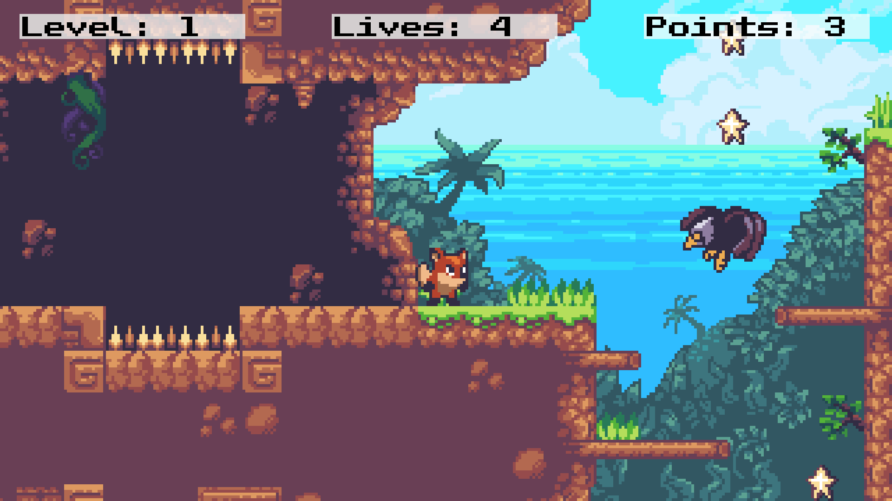

# SunnyLand

**SunnyLand** is a handcrafted 2D side-scrolling adventure game built with Unity. Inspired by classic platformers, it features pixel art visuals, physics-based interaction, multiple enemy types, and collectible items. This project showcases level design, gameplay mechanics, and player feedback systems using Unity's built-in tools.

## 📺 Play Online

You can play the game on itch.io:
👉 [**SunnyLand by vaemnor**](https://vaemnor.itch.io/sunnyland)

## 🧩 Features

* **2D Platformer Gameplay**

  * Side-scrolling action with tight jump-and-run controls.
  * Enemies with varied movement patterns.

* **Player Mechanics**

  * Jump on enemies to defeat them.
  * Push physics-based blocks to solve spatial puzzles.
  * Collect stars and diamonds to gain points.
  * Gather cherries to restore lives.
  * Retry system: Continue a level after losing all lives, keeping your score.

* **Level Design**

  * Two handcrafted levels with increasing difficulty.
  * Designed for exploration, platforming, and combat balance.



## 📦 Dependencies & Assets

This project uses the following free asset:

* [Sunny Land - Pixel Game Art by Ansimuz](https://ansimuz.itch.io/sunny-land-pixel-game-art)

> 🎨 All assets belong to their respective creators. This project uses them for non-commercial and educational purposes.

## 🚀 Getting Started

To run this project locally:

1. **Clone the repository**:

   ```bash
   git clone https://github.com/vaemnor/SunnyLand.git
   ```

2. **Open in Unity**:

   * Launch **Unity 2022.3.10f1**.
   * Open the cloned project folder in the Unity Hub or from the Unity editor directly.

3. **Play the Game**:

   * Open the main scene (e.g., `TitleScreen.unity`).
   * Press `Play` to start the game.

> ⚠️ This project was built and tested using Unity 2022.3.10f1. Using an earlier version may result in compatibility issues.

## 🎮 Controls

| Action          | Key(s)                 |
| --------------- | ---------------------- |
| Move Left/Right | `A` / `D` or `←` / `→` |
| Jump            | `W` / `Spacebar` / `↑` |

## 📃 License

This project is provided for educational and portfolio purposes only and is not intended for commercial distribution.
